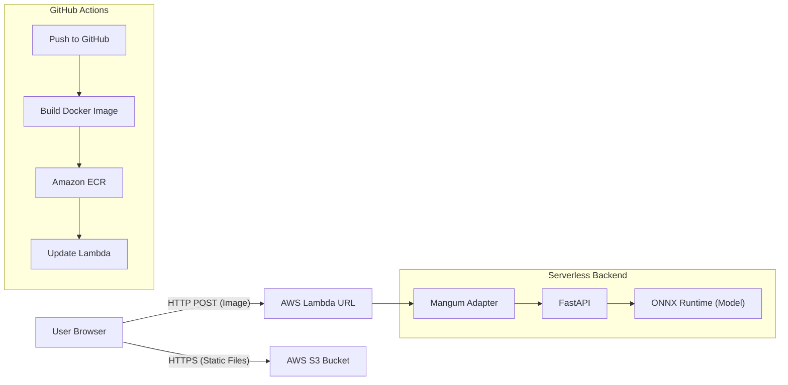

# Serverless MNIST Digit Recognizer 🤖☁️


A full-stack AI application deployed using a modern **Serverless DevOps architecture**. This project demonstrates how to bridge the gap between Data Science and DevOps by containerizing a Computer Vision model and deploying it via a completely automated CI/CD pipeline.

**[🔴 Live Demo Link](http://mnist-frontend-devops.s3-website.eu-north-1.amazonaws.com/)**

---

## 🏗 Architecture

The application is built on a **Microservices** architecture, decoupling the frontend from the inference engine.


## Technical Highlights

- Heavy Model on Lambda: Standard PyTorch models are too heavy for Lambda. I converted the model to ONNX format and used onnxruntime to reduce the image size by 70% and cold start times by 90%.

- Bypassing Size Limits: Lambda has a 250MB code limit. By packaging the application as a Docker Container stored in ECR, we can deploy images up to 10GB.

- Split CI/CD Pipelines: The repository uses a "Monorepo" pattern. GitHub Actions is configured to trigger the Backend Pipeline only when backend/ changes, and the Frontend Pipeline only when frontend/ changes, optimizing build costs.

## 🚀 Features

- Real-time Inference: Draw a digit and get a prediction in milliseconds.

- Serverless Scaling: Handles 0 to 1000+ concurrent requests automatically. Costs $0.00 when idle.

- Smart Pre-processing: The backend automatically inverts colors and normalizes inputs to match the MNIST training dataset (white text on black background), regardless of how the user draws.

- Interactive UI: Built with React and react-sketch-canvas, featuring real-time probability charts.

## 🛠 Tech Stack

| Component | Technology | Reasoning |
| :--- | :--- | :--- |
| **Frontend** | React + Vite | Fast build times and responsive UI state management. |
| **Backend** | FastAPI + Python 3.9 | Faster than Flask; auto-generates Swagger docs. |
| **AI Model** | ONNX (Open Neural Network Exchange) | Hardware-optimized inference; removes heavy PyTorch dependencies. |
| **Compute** | AWS Lambda (Container Image) | Serverless execution; pay-per-request model ($0 idle cost). |
| **Storage** | Amazon ECR & S3 | Secure Docker registry and low-cost Static Website Hosting. |
| **DevOps** | GitHub Actions | Automated "Build, Tag, Push, Deploy" CI/CD pipeline. |

## 📂 Project Structure

```bash
├── .github/workflows
│   ├── deploy.yml          # Backend CI/CD (Builds Docker -> Pushes to ECR -> Updates Lambda)
│   └── frontend-deploy.yml # Frontend CI/CD (Builds React -> Syncs to S3 Bucket)
├── backend
│   ├── app.py              # Main FastAPI application & Image Preprocessing logic
│   ├── Dockerfile          # Instructions to package Python 3.9 & dependencies for Lambda
│   ├── mnist-8.onnx        # The pre-trained Computer Vision model
│   └── requirements.txt    # Python dependencies (FastAPI, Mangum, Numpy < 2.0.0)
└── frontend
    ├── src/                # React source code (Components, CSS, Logic)
    ├── public/             # Static assets (Logos, Icons)
    ├── index.html          # Entry point for the Vite app
    └── vite.config.js      # Vite configuration for building the frontend
```

## 💻 Local Installation
To run this project on your local machine:

1. Backend Setup
cd backend
pip install -r requirements.txt
uvicorn app:app --reload
#### API will run at http://127.0.0.1:8000

2. Frontend Setup
cd frontend
npm install
npm run dev
#### App will run at http://localhost:5173

Note: You may need to change the API_URL in App.jsx to localhost for local testing.

## ⚙️ DevOps & CI/CD Strategy
### Backend Pipeline (deploy.yml)
1. Trigger: Pushes to main involving backend/ folder.

2. Build: Creates a Docker image using public.ecr.aws/lambda/python:3.9.

3. Fix: Explicitly pins numpy<2.0.0 to resolve onnxruntime compatibility issues.

4. Push: Uploads the container to Amazon ECR.

5. Deploy: Updates the AWS Lambda function to point to the new image hash.

### Frontend Pipeline (frontend-deploy.yml)
1. Trigger: Pushes to main involving frontend/ folder.

2. Build: Installs Node.js dependencies and compiles React via Vite.

3. Deploy: Syncs the dist/ folder to the public S3 Bucket.

## 🐛 Challenges Solved
1. The "Numpy 2.0" Crash

- Issue: The deployment initially failed with cryptic C++ errors in CloudWatch.

- Root Cause: The latest numpy version (2.0.0+) introduced breaking changes for onnxruntime.

- Solution: Implemented a strict version pin numpy<2.0.0 in requirements.txt.

2. The Inversion Problem

- Issue: The model was trained on white digits/black background, but users draw on black digits/white background (or vice versa).

- Solution: Added logic in app.py to calculate average pixel intensity. If the image is "bright," it automatically inverts the colors before inference using PIL.ImageOps.

🤝 Contributing
Fork the repository.

Create your feature branch (git checkout -b feature/AmazingFeature).

Commit your changes (git commit -m 'Add some AmazingFeature').

Push to the branch (git push origin feature/AmazingFeature).

Open a Pull Request.

## 👥 Contributors

This project was built by:

* **Mustafa** - [GitHub Profile](https://github.com/MusW02)
* **Rayan Farhan** - [GitHub Profile](https://github.com/Rayan-Farhan)
* **Anas Soharwardy** - [GitHub Profile](https://github.com/AnasSoharwardy)
* **Mujtaba Junaid** - [GitHub Profile](https://github.com/MujtabaJunai)
* **Arman Faisal** - [GitHub Profile](https://github.com/k228708)
